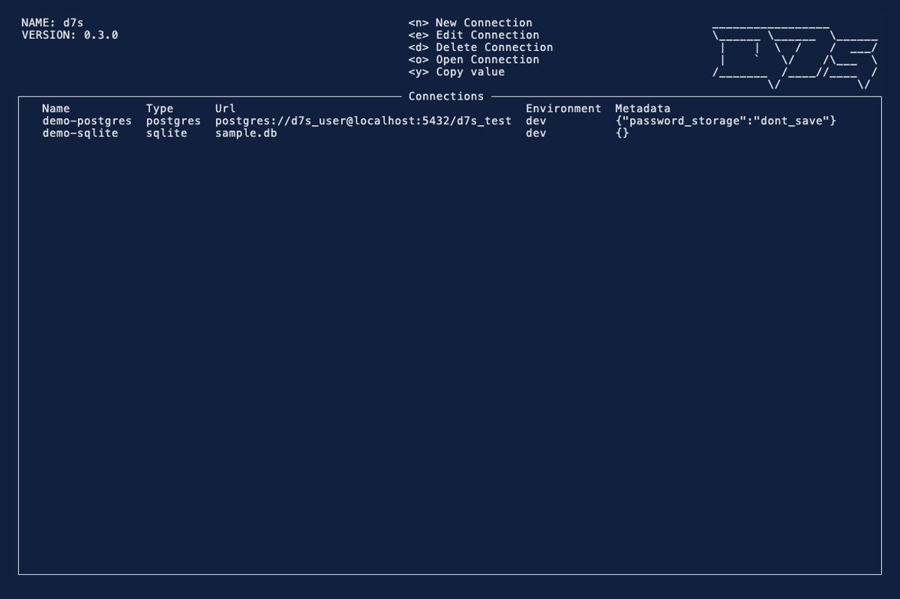

# d7s

A TUI database client for PostgreSQL and SQLite, built in Rust with [Ratatui](https://ratatui.rs) and inspired by [k9s](https://k9scli.io/).

## Why

After discovering k9s, I thought it had the perfect format for a database client and I wanted something simpler than the established solutions.

## Features

- **Multi-db Support** — currently supports PostgreSQL and SQLite, with more to come!
- **Connection management** — save, edit, and delete named connections.
- **Credential storage** — passwords are stored in the platform keyring (macOS Keychain, Windows Credential Manager, Linux Secret Service), or never saved and prompted everytime.
- **Database traversal** — navigate databases, schemas, tables, columns, and row data with keyboard-driven menus, supports vim.
- **SQL executor** — execute SQL from the editor, choose a statement when multiple are present, with read-only-by-default safety and confirmation for mutating statements.
- **Environment tagging** — label each connection as dev, staging, or prod.

## Screenshot



```sh
just demo
```

Requires [vhs](https://github.com/charmbracelet/vhs), `sqlite3`, and Docker. Uses an isolated HOME with fake connections only — assets and launcher in `demo/` (`D7S_DEMO` hides local paths in the recording).

## Install

### crates.io

Requires Rust stable (1.91.0 or later).

```sh
cargo install d7s --locked
```

The `d7s` binary will be placed in `$CARGO_HOME/bin` (usually `~/.cargo/bin`), which should already be on your `PATH`.

### Building from source

Requires Rust stable (1.91.0 or later).

```sh
cargo build --release --locked
```

The binary will be at `target/release/d7s`.

### Nix

A `flake.nix` is provided. Enter the development shell:

```sh
nix develop
```

Then use `just` for common tasks (`just --list`).

## Usage

```sh
d7s
```

Or, if built from source:

```sh
cargo run --release
# or, after building:
./target/release/d7s
```

## Hotkeys

Global:

| Key | Action |
|-----|--------|
| `q` / `Ctrl-c` | Quit |
| `y` | Copy selected value |
| `j`/`k` or ↓/↑ | Move down / up |
| `h`/`l` or ←/→ | Move left / right |
| `g` / `G` | Top / bottom |
| `0` / `$` | First / last column |

Connections:

| Key | Action |
|-----|--------|
| `n` | New connection |
| `e` | Edit connection |
| `d` | Delete connection |
| `o` / Enter | Open connection |

Connected:

| Key | Action |
|-----|--------|
| `e` | SQL editor |
| `E` | Run SQL |
| `t` | Toggle table structure |
| `/` | Search |
| `1`–`5` | Jump to recent table |

Table data:

| Key | Action |
|-----|--------|
| `r` | Refresh |
| `a` | New row |
| `c` | Copy row as draft |
| `s` | Commit draft row |
| `d` | Delete row |
| Space | Edit cell |
