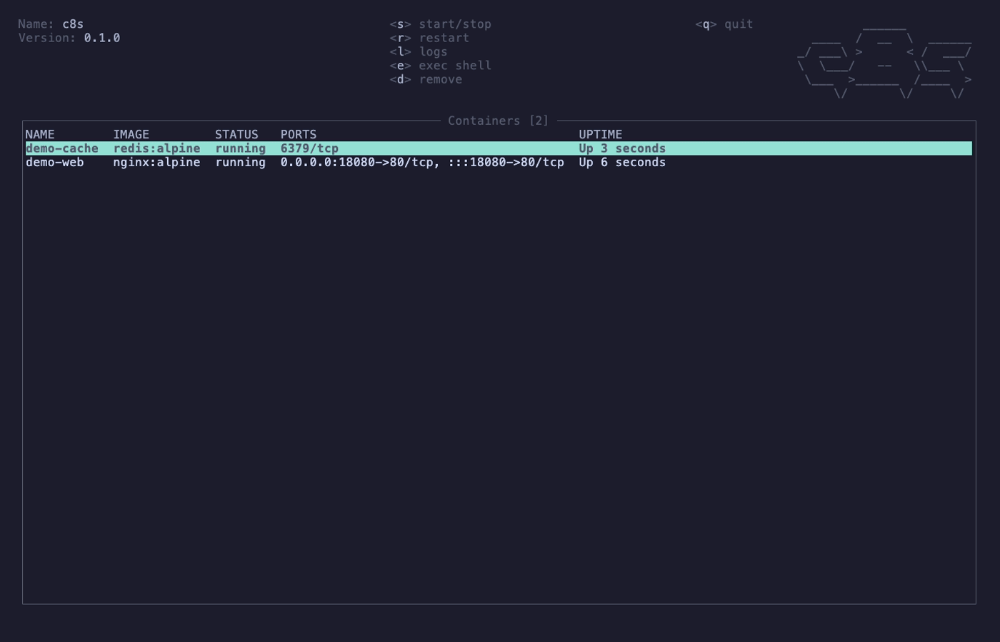

# c8s

A k9s-style TUI for Docker containers, built in Rust with [Ratatui](https://ratatui.rs), reusing [k9tui](../k9tui)'s chrome.



```sh
just c8s-demo
```

Requires [vhs](https://github.com/charmbracelet/vhs) and Docker. Starts fake `demo-web`/`demo-cache` containers, records, tears them down (`just c8s-demo-prep` / `just c8s-demo-teardown` to run those steps separately).

## Features

- **Container list** — name, image, status, ports, and uptime, polled from the Docker daemon every ~2 seconds.
- **Container actions** — start/stop (`s`), restart (`r`), remove with confirmation, defaulting to No (`D`/`Delete`).
- **Image list** — repo:tag, id, size, and created-ago, with remove (`D`, confirm).
- **Volume list** — name, driver, and mountpoint, with remove (`D`, confirm).
- **Network list** — name, driver, and scope, with remove (`D`, confirm).
- **View switching** — jump between the container/image/volume/network lists with `1`/`2`/`3`/`4` or the `:` command bar (`:images`, `:v`, ...).
- **Sorted lists** — all four resource lists sort alphabetically by name (images by repo:tag) so ordering stays stable between polls.
- **Search** — `/` opens a live substring filter across all columns in the active list view (works for containers, images, volumes, and networks); `Enter` commits, `Esc` clears and closes.
- **Live log tail** — full-screen streamed logs for the selected container (`l`, `q`/`Esc` to return).
- **Describe view** — full-screen `docker inspect`-style details (id, image, status, PID, ports, mounts, env, created time) for the selected container, image, volume or network (`d` or `Enter`, `q`/`Esc` to return).
- **Exec shell** — suspends the TUI and hands the real terminal to `docker exec -it <id> sh` (`e`), resuming the TUI on exit.
- **Connection error screen** — if the Docker daemon is unreachable at startup, shows an error with a retry action instead of panicking.
- **Daemon health panel** — press `i` for a snapshot of the connected daemon: Docker/API version, OS/arch, and container counts by state plus image count (`q`/`Esc`/`i` to return). c8s only ever talks to one daemon, so this is its single-daemon analog of a fleet-wide health dashboard rather than a multi-daemon view.

## Requirements

A running Docker daemon reachable at the default `docker.sock`, and the `docker` CLI on `PATH` for the exec-shell action.

## Usage

```sh
cargo run -p c8s
```

Or, after building:

```sh
cargo build --release -p c8s
./target/release/c8s
```

## Hotkeys

| Key | Action |
| --- | --- |
| `1`/`2`/`3`/`4` | Switch view: containers / images / volumes / networks |
| `j`/`k`, `↑`/`↓` | Move selection |
| `g`/`G` | Jump to top/bottom |
| `:` | Command bar: `:containers`/`:c`, `:images`/`:i`, `:volumes`/`:v`, `:networks`/`:n`, `:q`/`:quit` (unique prefixes work; Tab completes, Enter runs, Esc cancels) |
| `/` | Open search: live substring filter over the active list view (`Enter` commits, `Esc` clears) |
| `s` | Start (if stopped) or stop (if running) the selected container (containers view) |
| `r` | Restart the selected container (containers view) |
| `l` | Tail logs for the selected container (containers view) |
| `e` | Exec an interactive shell in the selected container (containers view) |
| `D` / `Delete` | Remove the selected item in the active view (confirm) |
| `d` / `Enter` | Describe the selected container, image, volume or network (`q`/`Esc` to return) |
| `i` | Daemon health panel (version, container counts by state, image count) |
| `q` / `Ctrl-C` | Quit |

### Key semantics vs k9s

- `d` describes the selected resource, as in k9s. Destructive actions sit
  behind Shift: `D`/`Delete` removes the selected item (confirm dialog,
  defaulting to No).
- There is no `y` binding: k9s's `y` shows the resource's YAML manifest, but
  containers, images, volumes, and networks have no manifest to show here.
- `/` filters whichever list is shown (containers, images, volumes, or
  networks) by substring, matching k9s's filter key (and d7s's `/`), rather
  than k9s's fuzzy match across the whole resource list.

## Scope

v1 covers containers, images, volumes, and networks as separate list views — no compose grouping or stats/CPU graphs.
