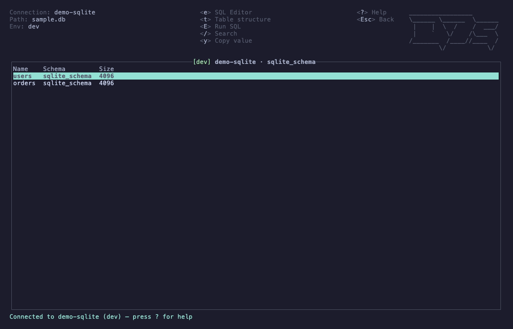

# d7s

A TUI database client for PostgreSQL and SQLite, built in Rust with [Ratatui](https://ratatui.rs) and inspired by [k9s](https://k9scli.io/).

## Why

After discovering k9s, I thought it had the perfect format for a database client and I wanted something simpler than the established solutions.

## Workspace layout

This repo is a Cargo workspace with three crates:

- **[`crates/d7s`](.)** — the database TUI client covered by this README (db/auth/app-state logic and the binary).
- **[`crates/k9tui`](../k9tui)** — a reusable k9s-style ratatui widget kit (theme, tables, modals, top bar, hotkeys) extracted from `d7s`, with no dependency back on it. See its [README](../k9tui/README.md).
- **[`crates/c8s`](../c8s)** — a k9s-style TUI for Docker containers, the second consumer of k9tui's chrome. See its [README](../c8s/README.md).

d7s and c8s are the shipped apps; k9tui exists so k9s-style TUI apps in this workspace can reuse its chrome. The rest of this README covers d7s specifically.

## Features

- **Multi-db Support** — currently supports PostgreSQL and SQLite, with more to come!
- **Connection management** — save, edit, and delete named connections.
- **Credential storage** — passwords are stored in the platform keyring (macOS Keychain, Windows Credential Manager, Linux Secret Service), or never saved and prompted everytime.
- **Database traversal** — navigate databases, schemas, tables, columns, and row data with keyboard-driven menus, supports vim.
- **SQL executor** — execute SQL from the editor, choose a statement when multiple are present, with read-only-by-default safety and confirmation for mutating statements.
- **Watch mode** — re-run the current SQL results query every 2s (`w`) until toggled off.
- **Activity view** (Postgres only) — `A` shows currently-running backends from `pg_stat_activity` (pid, query, state, wait_event, query_start); not applicable to SQLite, which has no server process to inspect.
- **Query log** — `L` lists every query d7s ran this session (your SQL, watch ticks, activity and metadata queries), newest first, with origin, duration and rows or error; bounded to the last 500. Esc/`q` returns.
- **Environment tagging** — label each connection as dev, staging, or prod.
- **Connection health check** — press `p` in the connection list to ping every saved connection concurrently (a TCP connect to host:port for Postgres, a file-exists check for SQLite; no login) and see an up/down status per row, without fully connecting.

## Demo



```sh
just demo
```

Requires [vhs](https://github.com/charmbracelet/vhs) and `sqlite3`. Uses an isolated HOME with fake connections only — assets and launcher in `demo/` (`D7S_DEMO` hides local paths in the recording).

## Install

### crates.io

Requires Rust stable (1.91.0 or later).

```sh
cargo install d7s --locked
```

The `d7s` binary will be placed in `$CARGO_HOME/bin` (usually `~/.cargo/bin`), which should already be on your `PATH`.

### Building from source

Requires Rust stable (1.91.0 or later).

```sh
cargo build --release --locked
```

The binary will be at `target/release/d7s`.

### Nix

A `flake.nix` is provided. Enter the development shell:

```sh
nix develop
```

Then use `just` for common tasks (`just --list`).

## Usage

```sh
d7s
```

Or, if built from source:

```sh
cargo run --release
# or, after building:
./target/release/d7s
```

CLI flags: `-c`/`--connection NAME`, `-h`/`--help`, `-V`/`--version`.

## Hotkeys

Global:

| Key | Action |
|-----|--------|
| `q` / `Ctrl-c` | Quit |
| `?` | Toggle help |
| `y` | Copy selected value |
| `Y` | Copy selected row (TSV) |
| `j`/`k` or ↓/↑ | Move down / up |
| `h`/`l` or ←/→ | Move left / right |
| `g` / `G` | Top / bottom |
| `0` / `$` | First / last column |

Connections:

| Key | Action |
|-----|--------|
| `n` | New connection |
| `e` | Edit connection |
| `D` | Delete connection |
| `o` / Enter | Open connection |
| `O` | Reconnect last connection |
| `p` | Ping health check (all saved connections, up to 3s) |
| `d` | Describe selected connection |

Connected:

| Key | Action |
|-----|--------|
| `e` | SQL editor |
| `E` | Run SQL |
| `t` | Toggle table structure |
| `d` | Describe selected table/column/row |
| `/` | Search |
| `1`–`5` | Jump to recent table |
| `L` | Query log (session history of all queries d7s ran, tagged by origin) |
| `A` | Activity view (Postgres `pg_stat_activity`; not applicable for SQLite) |
| `:` | Command bar (see below) |

Table data:

| Key | Action |
|-----|--------|
| `r` | Refresh |
| `a` | New row |
| `c` | Duplicate row as draft |
| `s` | Commit draft row |
| `D` | Delete row |
| Space | Toggle multi-select |
| Enter | Edit cell |
| `#` | Jump to row number (or `:123`) |

SQL results:

| Key | Action |
|-----|--------|
| `Ctrl-s` / `x` | Export results to temp TSV |
| `w` | Toggle watch (re-run query every 2s until toggled off or the query/view changes) |

Paste works in connection/cell/password modals and the search bar (bracketed paste).

### Command bar (`:`)

`:` opens the same bottom bar as `/`, with a `:` prompt and a dimmed completion (Tab accepts, Enter runs, Esc cancels, Ctrl-C quits).

| Command | Action |
|---------|--------|
| `:connections` / `:conn` | Back to the connection list |
| `:schemas` | Schema list (Postgres) |
| `:tables` | Tables of the current schema |
| `:columns` / `:cols` | Columns of the current/selected table |
| `:sql` / `:editor` | SQL editor |
| `:log` / `:querylog` | Query log |
| `:activity` | Activity view (Postgres only) |
| `:help` | Help |
| `:q` / `:quit` | Quit |
| `:<table>` | Open that table's data (exact, then prefix, then substring match; case-insensitive) |
| `:123` | Jump to row 123 (table data) |

Unique prefixes work (`:sch`). Navigation commands are refused while a draft row is pending.

### Key semantics vs k9s

- `y` copies the selected cell value (and `Y` the row as TSV) here, unlike
  k9s where `y` shows the resource's YAML manifest. There is no manifest
  concept in a relational-table client.
- `d` describes the selected connection, table, column or row, as in k9s.
  Destructive actions sit behind Shift: `D` deletes the selected connection
  or row (confirm dialog).
- `/` filters the current view's rows by substring, matching k9s's filter key
  and UX intent, scoped to whichever table/list is on screen rather than a
  single global resource list.
